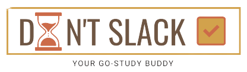

#DON'T SLACK

##Team Member's names, student IDs
    - Chia Jiun Hong - S10222651
    - Lee Hwee Min - S10223008
    - Gabriel Koh Quan Kai - S10219353
    - Gan Haowen - S10227840
    - Sumayyah Binte Zaini - S10223863

##All About Don't Slack

###Application Icon

###Application Logo

###Description
Don't Slack is an application created for user's to gain focus through their daily tasks.
In this application, users can mainly create tasks, set a start time and a deadline to time themselves and feel 
accomplished upon completion. 

###Features
Some of our main features include:
    - Add tasks
    - Set start time and deadline
    - Create Notes
    - Set Events on Calendar

##Target Audience
Our application mainly targets students who seek a study buddy who can help them focus
through their daily school tasks. With a start time and deadline set, students would be able 
to track their progress and manage their time wisely. 

But other than students, our application allows users to categorise their tasks according
to Work and Personal tasks. This way, our target audience extends to not just students, but to working adults, 
seniors and of course, to the procrastinators. 

##Roles and contributions for each of our member

**Jiun Hong**
- To-Do List Feature
    - Add Task
    - Set Timer
- Database implementation
- Account Login/signup implementation
- Calendar Add Event Feature

**Haowen**
- Notes Feature

**Gabriel**
- Calendar Feature

**Hwee Min**
- Layout & Design

**Sumayyah**
-Layout & Design 

##All relevant appendices (diagrams, screenshots, user guides)
