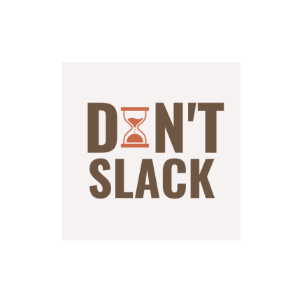

# **DON'T SLACK**

## Team Member's names, student IDs
    - Chia Jiun Hong - S10222651
    - Lee Hwee Min - S10223008
    - Gabriel Koh Quan Kai - S10219353
    - Gan Haowen - S10227840
    - Sumayyah Binte Zaini - S10223863

# **All About Don't Slack**

### Application Icon

### Application Logo

### Description
Don't Slack is an application created for user's to gain focus through their daily tasks.
In this application, users can mainly create tasks, set a start time and a deadline to time themselves and feel 
accomplished upon completion. 

### Features
Some of our main features include:
- Add tasks
- Set start time and deadline
- Create Notes
- Set Events on Calendar
- Daily reminder of tasks and events
- Motivation quote of the day
- Focus mode
- Music player
- Home Screen Widget to view task left

## Target Audience
Our application mainly targets students who seek a study buddy who can help them focus
through their daily school tasks. With a start time and deadline set, students would be able 
to track their progress and manage their time wisely. 

But other than students, our application allows users to categorise their tasks according
to Work and Personal tasks. This way, our target audience extends to not just students, but to working adults, 
seniors and of course, to the procrastinators. 

## Roles and contributions for each of our member

**Jiun Hong** (The Coder)
- To-Do List Feature Implementation
    - Add new task
    - View all task
    - View a task details
    - Edit a task details
    - Delete a task
- Database Implementation
    - Store User account data
        - Find User account data
        - Add a User account data
        - Update User acccount data
        - Delete User account data
    - Store To_Do task data
        - Retrive all To_Do task data
        - Find a To_Do task data
        - Add a Calender event data
        - Update a To_Do task data
        - Delete a To_Do task data
    - Store Calendar event data
        - Retrive all Calendar event data by date
        - Add a Calendar event data
        - Delete a Calendar event data
- Account Implementation
    - Login
    - Logout
    - View Profile
    - Change Password
    - Delete Account
- Calendar Event Feature Implementation
    - Add a Calendar event
    - Delete a Calendar event 
- Brainstorm app feature ideas
- Giving feedback to layout

=====Part 2=====
- Not covered topics that used to implement feature: 
    - Manage Device awake state
        - Schedule alarms
    -   Widget
        - Time Picker
    
- Feature implemented:
    - Daily Notification reminding the user of all the tasks and events of the day. 
      User are able to enable or disable this feature and are allow to set the time they wish the reminder is delivered to them.
     
**Haowen** (The Coder)
- Notes Feature
  - Add new note
  - Edit notes with note editor
  - Save notes
  - Delete notes

**Gabriel** (The Coder)
- Calendar Feature

**Hwee Min** (Layout Designer)
- Layout & Design
    - Wireframe Prototyping
    - Color Theme
    - Fixing Layout errors
    - Adjusting Layouts & Changing Color Combinations
- To-Do List Layout
    - Complete task button in fragment
- Calender Layout
    - Layout for editing events
- Notes Layout
    - Editing the add notes button
- Contact Us Layout
- Settings Layout
- About Us Layout
- Changing Mainpage launcher & setting portrait mode
- Linking the pages together

**Sumayyah** (Leader and Layout Designer)
- Layout & Design 
    - App Wireframing on Adobe XD
    - Color & Theme Scheming
    - App Logo Design
    - App Icon Design
- Profile Layout
- Homepage Layout
- Login & Signup Layout & Background implementation
- To-Do List Layout
   - Add Task
   - Task Detail
   - Edit Task 
- Notes Layout
    - Edit Notes

## All relevant appendices

*User Guides with screenshots and diagrams*

**1. How to install Don't Slack**

    1. On your android phone, open Play Store
    2. Tap the search icon
    3. Type in "22 Don't Slack"
    4. Select the Don't Slack app in the search results to go to the app page
    5. Click on the install button
    
**2. How we ensure the security of user's data**
    
   User's data are secured because we will not collect any data from users. Similarly,      there are no data collected nor shared to other users.

**3. Create new account**

To use the app, users are not required to have an account because users data and progress will still be saved within the app.  

Additionally, if users do create an account, users will be able to have their own profile.

**4. App Overview**

Don't Slack consists of three main features. The To-Do List, Notes, and Calendar. 
On the app landing page, users will be able to view all three features, to begin their progress on their tasks.

**4.1 To-Do List**

This page is where users will be able to view the lists of tasks they have entered in. Our app allows users to separate their tasks into 2 categories. Work and Personal. 

To add a task, users will have to click on the 'Work' or 'Personal' tab, and click on the add button.

**4.1.1 To-Do List: Add New Task**

This page will require users to enter information on their task. The title, description, starttime and deadline. When all fields are filled in, click on the 'Create' button at the bottom.

**4.1.2 To-Do List: Task Details**

All details of the task can be viewed and edited on this page. Moreover, on Don't Slack, users can begin a timer to keep their focus. 

**4.1.3 To-Do List: Edit Task**

The edit page allows user to edit their details with ease and also enables them to delete their tasks. Users can click on 'Save' button when finished.

**4.2 Notes**

Our Notes function provides users with a space to jot down notes and details especially for their tasks. Simply by clicking onto the button on the bottom right corner of the page.

This is the page where users can begin to write down their notes.

How to delete your notes?

Click and hold onto ur notes, and an alert box will appear, click 'YES', and it will be deleted.

**4.3 Calendar**

Don't Slack provides our users with their very own Calendar, each date allows multiple events to be added in. 

When you click on the 'New Event' button, this page appears. Enter the fields correclty and click 'Save'. Your event will be created and listed successfully underneathe the Calendar.

How to delete an event?

Click on the event you want to delete and press hold for about 2 second. An alert box will appear and give user the option to delete.

**5. Profile**

The profile page shows users their username and password. Moreover, this is where users can change their passwords on this page by clicking on the 'change' button, and also delete their account. 

How to Logout?

Users also have the option to Logout using the Logout button on this page.

**6. Contact Us**

Should users encounter any problems while using the app, we provide a contact page, with an email address as a channel for users to direct their issues.

**7. Settings**

To enable notifications on, users can go to the settings page, and toggle the notificiations on

To learn more about the app, it's background, and to read on the Terms & Conditions of the app, users can click on the About tab. 

